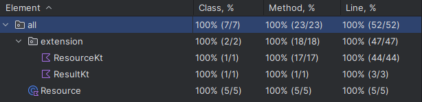

# Resource 

Complete solution for handling success, failure, and loading states in Kotlin.

## Loading

Use the sealed class [`Resource`](src/main/kotlin/Resource.kt) with loading states.

``` kotlin
ordersRepository.flow.collect { resource ->
    when (resource) {
        is Resource.Result.Failure -> //...
        is Resource.Result.Success -> //...
        Resource.Loading -> //...
    }
}
```

## Result

If the possible states are success and error, the ideal class is `Resource.Result`.

``` kotlin
when (ordersRepository.getOrders()) {
    is Resource.Result.Failure -> //...
    is Resource.Result.Success -> //...
}
```

## Extensions

The library comes with some basic [extensions](src/main/kotlin/extension/Resource.kt) to handle and
manipulate the states.

## kotlin.Result

Integration with kotlin Result.

``` kotlin
suspend fun getOrders(): Resource.Result<List<Order>, String> {
    val result = runCatching {
        service.getOrders()
    }.toResource()
    
    return result.mapError {
        it.message ?: ""
    }.ifFailure {
        logger.send("error: $it")
    }.ifSuccess {
        logger.send("success: $it")
    }
}
```

## Coverage

One hundred percent of the code covered by unit tests.



## Releases

The latest release is available on [JitPack](https://jitpack.io/#NeoUtils/Resource).

Add the jitpack to project in root `build.gradle.kts` or `settings.gradle.kts`:

``` kotlin
repositories { 
    maven { url = uri("https://jitpack.io") }
}
```

Add the dependence to module:

``` kotlin
implementation("com.github.NeoUtils:Resource:{version}")
```

## License
```
Copyright (c) 2023 Irineu A. Silva

This project is licensed under the terms of the MIT License, 
a permissive open-source license that allows for the use, modification, 
and distribution of the code, provided that copyright notices and 
the license statement are included in all copies or modifications. 
```
